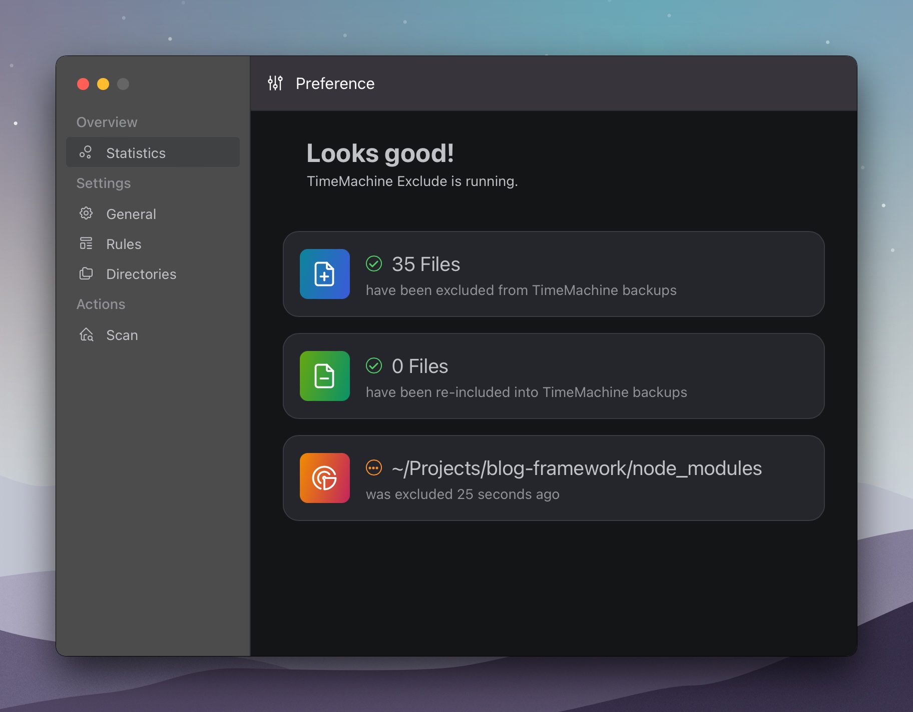
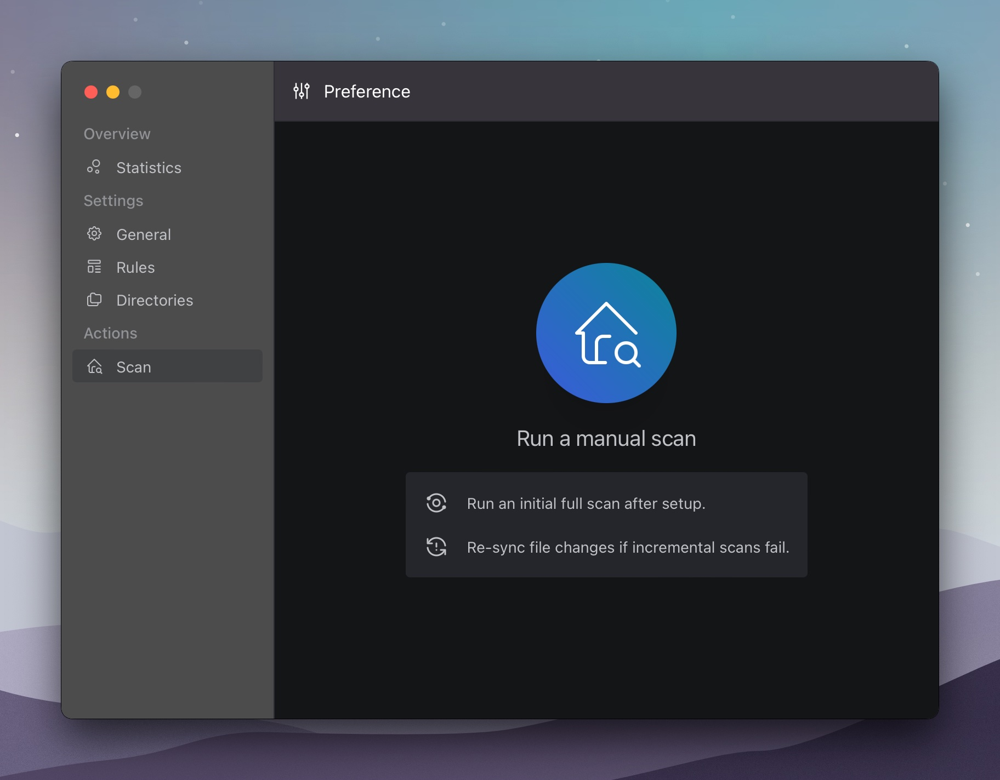

# TimeMachine Exclude (tmexclude)

[CHANGELOG](./CHANGELOG.md)

Exclude undesired files (node_modules, target, etc) from your TimeMachine backup.

This utility watches your filesystem and excludes the files once they appear, so you won't accidentally include them
in your backups. Full scans can also be performed manually to ensure no file slips through the watcher.

Screenshots available [here](#screenshots).

*If you find this utility useful, please consider [buy me a coffee](https://buymeacoffee.com/lightquantum).*

## Installation

Binary releases are available [here](https://github.com/PhotonQuantum/tmexclude/releases).

## Configuration

While you may configure tmexclude through the GUI, you may also use a configuration file.

See [`config.example.yaml`](config.example.yaml) for an example configuration file.

The config file is located at `~/.config/tmexclude.yaml`.
A default config is generated when the application starts if it doesn't exist.

After modifying the config file manually, you must restart the application for the changes to take effect.

## Screenshots

## License

This project is licensed under [MIT License](LICENSE.txt).